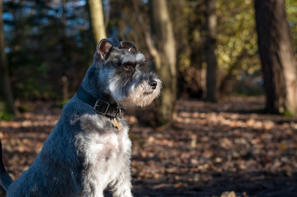

In this blog post I'm going to talk about a one of my favourite **breeds of dog**!

## Schnauzer
Schnauzers originated in **Germany** during the 14-16th centuries.

There are three types: miniature, standard, and giant.
- Miniature Schnauzers are usually around _30 cm tall_ and _weigh 6-9 kg_.
- Giant Schnauzers are usually around _62 cm tall_ and can _weigh **up to 36** kg_.

---

> “Dogs are not our whole life, but they make our lives whole.”
> – Roger Caras

Thanks for reading, you can read more about Schnauzers [here](https://www.akc.org/dog-breeds/standard-schnauzer/)!
